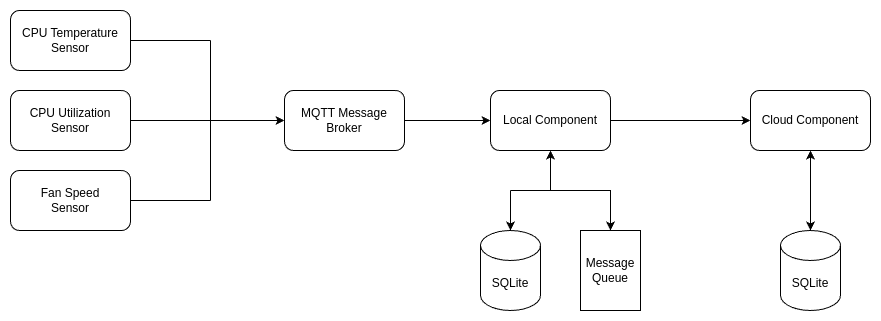

# Fog Computing Prototyping Assignment

## Table of Contents

- [Architecture Overview](#architecture)
- [Recovery Mechanisms](#recovery-mechanisms)
- [Installation](#installation)
- [Notes](#notes)
- [Thought Process](#thought-process)
- [License](#license)

## Architecture

The system consists of three sensors that publish their measurements to the MQTT Message Broker. The local component subscribes to the topics used by the sensors and receives the data. It then starts processing it by adding every data point to the local SQLite DB with the delivered flag set to false. Next, it pushes the data point to the message queue.

The message queue reacts to new messages by sending them via WebSocket. If the connection is closed, it keeps the data waiting for the connection to reopen. After sending the data to the Cloud Component, it waits a specified time period (3 seconds by default, configurable) for a confirmation. After receiving confirmation for a given message, it removes it from the queue and updates the delivered flag to true in the local DB. In case of a confirmation timeout, the message will be sent again.

The Cloud Component hosts a WebSocket server and receives messages via WebSocket connections. After receiving a new message, it checks whether a message with this ID has not yet been stored in the local SQLite DB. If not, it stores the message and sends back the confirmation.

## Recovery Mechanisms

### Loosing Connection

1. Connection Closure Handling:

   - When the WebSocket connection is closed, the system halts sending data. New data points from the sensors continue to be added to the local SQLite DB with the delivered flag set to false and to the message queue, awaiting reconnection.

1. Exponential Backoff for Reconnection Attempts:

   - The local component attempts to reconnect to the WebSocket server using an exponential backoff strategy. The backoff times start at 1 second and double each time (e.g., 1, 2, 4, 8, 16, 32 seconds).
   - After reaching the maximum backoff time of 32 seconds, the local component continues to retry at this interval until a successful reconnection is established.

1. Handling Backlogged Messages:

   - Upon successful reconnection, the local component sends all messages from the queue to the Cloud Component. This ensures that no data points are lost during the disconnection period.

### Local Component Crash Recovery

1. Restart Behavior:

   - If the local component crashes and subsequently restarts, it initiates a recovery procedure. The component queries the local SQLite DB for all data points with the delivered flag set to false.
   - These undelivered data points are re-added to the message queue for transmission.

1. Ensuring Data Persistence:

   - This process guarantees that no data points are lost due to a crash. The system maintains data integrity by ensuring all previously undelivered messages are sent after recovery.

## Installation

### To run this project locally:

1. Clone this repository
2. refer to the readmes in component folders

   - Sensor
   - LocalServer
   - CloudServer

### Running in docker

1. Clone the repository
2. Go to `docker-environment` directory
3. run `docker compose up -d`

NOTE: requires `docker` installed

## Notes

- This application requires Node.js and npm to be installed on your system if running locally.
- Ensure the MQTT broker specified in `MQTT_BROKER_HOST` is running and accessible from the application.

## Thought Process

## License

This project is licensed under the [MIT License](./LICENSE).
